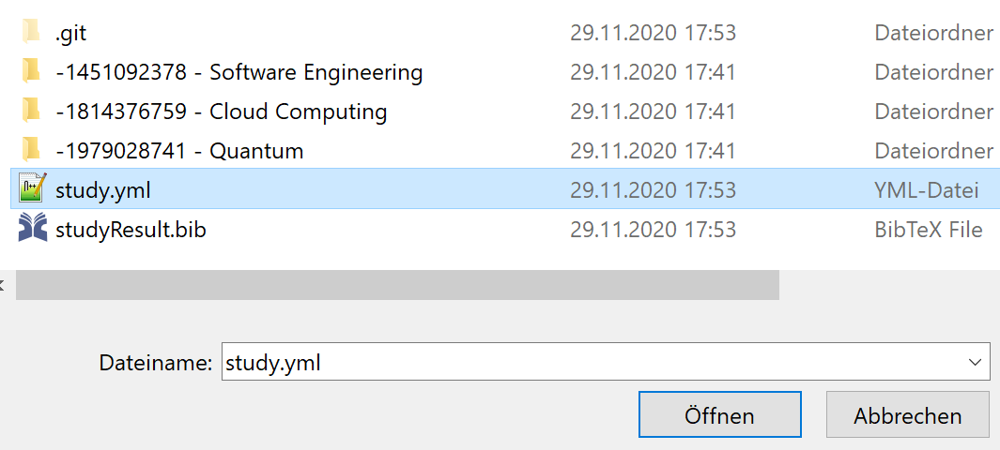

# Conducting automated cross-library search

## Providing a study file for automated search

To provide automated search JabRef needs the set of targeted digital libraries and the used queries.
To provide these a `study.yml` file, also called study definition, has to be created.
This file contains different entries with different information.
This file have to be provided within an otherwise empty fully setup git repository.

Example study definition file:

```yaml
authors:
- Jab Ref
- Ref Jab
studyName: TestStudyName
lastSearchDate: 2020-11-26
researchQuestions:
- Question1
- Question2
queries:
- query: Quantum
- query: '"Software Engineering"'
libraries:
- name: Springer
- name: IEEEXplore
  enabled: false


}
```

## Executing the automated search

To execute the automated search navigate in the toolbar to **Tools\|Start systematic literature review** and click it.


Then select the `study.bib` file in the file explorer dialogue that is located in the git repository.



After that the automated search is executed and any new studies are commited and pushed to the configured git repository.
The local repository now contains the retrieved studies sorted by the respective query and digital library that retrieved it.


The `result.bib` located in the query folder contains the merged results from all fetcher for the respective query.
The `studyResult.bib` contains the merged results for all queries.
